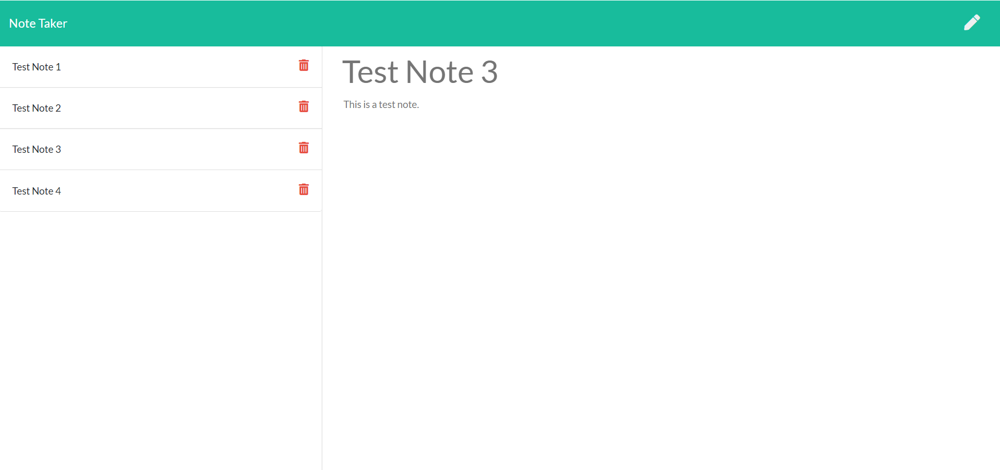

# Express_Note_Taker

The objective of this project was to create a note taker application that can write, save, and delete notes. In order to achieve this objective, an express backend was utilized to retrieve note data from a JSON file. A screenshot of the deployed application can be found below.

